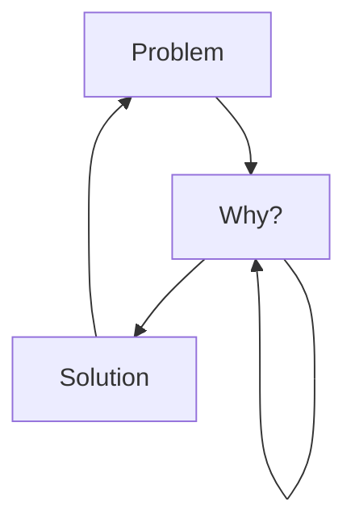

# Jerome-Spaeter
I'm Jérôme from France, living in Strasbourg, junior full stack developer student, I like to learn languages, frameworks and cybersecurity in general.

<!--
**Jerome-Spaeter/Jerome-Spaeter** is a ✨ _special_ ✨ repository because its `README.md` (this file) appears on your GitHub profile.
-->

### Actually:

- 💻 I’m currently working in formation [id-formation][ID] ...
- 🌱 I’m currently learning bases FullStack developper ...
- 🐱‍💻 I'm also taking cybersecurity courses [cyberini][cyberini] ...
- 💎 I help people at my level to discover WEB 3.0 and blockchain ...
- ⚡ Fun fact : I have a manual background, especially in metalwork and construction ...
- 📧 How to reach me : [email][mail] ...

### Languages and Tools:

[][HTML]
[][CSS]
[][JS]
[][python]
[][Vue.js]
[][symfony]
[][php]

  

  
Latest achievements

  
<!-- BLOG-POST-LIST:START -->
- [I have obtained the Tosa CyberCitizen certification](https://www.tosa.org/EN/cybers%C3%A9curit%C3%A9-certification?sbj_id=298)
- [I took free web developer courses on openclassroom](https://openclassrooms.com/fr/search?page=1&categories=D%C3%A9veloppement)

### My daily routine :

 

### Connect with me:

&nbsp;&nbsp;

&nbsp;&nbsp;

&nbsp;&nbsp;

&nbsp;&nbsp;

 

### 🔥 GitHub Stats

[ID]: https://id-formation.com/
[cyberini]: https://cyberini.com/
[HTML]: https://developer.mozilla.org/fr/docs/Web/HTML
[CSS]: https://developer.mozilla.org/fr/docs/Web/CSS
[JS]: https://developer.mozilla.org/fr/docs/Web/JavaScript
[python]: https://www.python.org/
[Vue.js]: https://vuejs.org/
[symfony]: https://symfony.com/
[php]: https://www.php.net/
[mail]: m.spaeter@gmail.com
