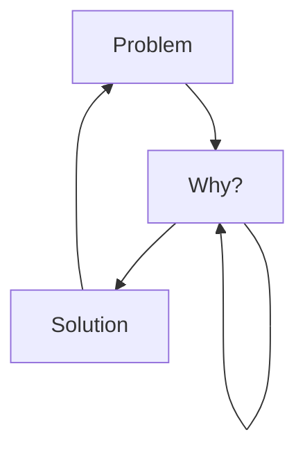

# Jerome-Spaeter
I'm Jérôme from France, living in Strasbourg, junior full stack developer student, I like to learn languages, frameworks and cybersecurity in general.

<!--
**Jerome-Spaeter/Jerome-Spaeter** is a ✨ _special_ ✨ repository because its `README.md` (this file) appears on your GitHub profile.
-->

### Actually:

- 💻 I’m currently working in formation [id-formation][ID] ...
- 🌱 I’m currently learning bases FullStack developper ...
- 🐱‍💻 I'm also taking cybersecurity courses [cyberini][cyberini] ...
- 📧 How to reach me : [m.spaeter@gmail.com][mail] ...

### Languages and Tools:

[][VisualStudio]
[][HTML]
[][CSS]
[][JS]
[][Vue.js]
[][php]
[][SQL]

  

  
Latest achievements

  
<!-- BLOG-POST-LIST:START -->
- [I have obtained the Tosa CyberCitizen certification](https://www.tosa.org/EN/Index?param=cGdOc2MydUltNjYycVE0cEVsd1QwVWhoZFdKN3Q0ekpEbzR4VnRLeTZZbk5Ob0cySU1KTHdhTDNwUngrbFovRVhkSXQ1ZEVobWlPMnBLY0V6TFNwSEE9PTo6Ia7-rjUcUMnsFtxxUkni5Q)

### My daily routine :

### Connect with me:

&nbsp;&nbsp;

&nbsp;&nbsp;

&nbsp;&nbsp;

&nbsp;&nbsp;

 

[ID]: https://id-formation.com/
[cyberini]: https://cyberini.com/
[VisualStudio]: https://code.visualstudio.com/
[HTML]: https://developer.mozilla.org/en-US/docs/Web/HTML
[CSS]: https://developer.mozilla.org/en-US/docs/Web/CSS
[JS]: https://developer.mozilla.org/en-US/docs/Web/JavaScript
[python]: https://www.python.org/
[Vue.js]: https://vuejs.org/
[php]: https://www.php.net/
[SQL]: https://developer.mozilla.org/en-US/docs/Glossary/SQL
[mail]: m.spaeter@gmail.com
